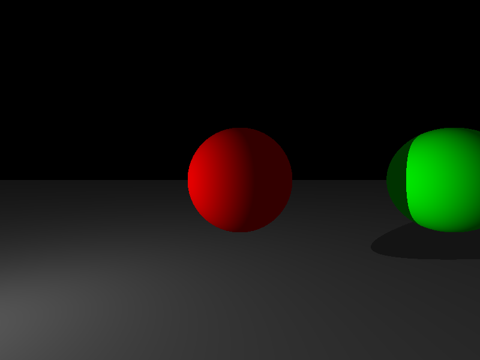

# miniRT - Ray Tracer Engine

<div align="center">

**A simple but powerful ray tracer built with C and MiniLibX**

[](https://42.fr)
[](https://github.com/42School/norminette)
[](LICENSE)
[]()

[Features](#features) • [Demo](#demo) • [Installation](#installation) • [Usage](#usage) • [Documentation](#documentation)

</div>

---

## 📖 About

**miniRT** is a minimalist ray tracing engine that renders 3D scenes with realistic lighting effects. This project is part of the 42 School curriculum, implementing the fundamentals of computer graphics and ray tracing algorithms.

### ✨ Key Highlights

- 🎯 **Pure C Implementation** - No external rendering libraries
- 🖥️ **Cross-Platform** - Works on macOS and Linux
- 🔍 **Ray-Object Intersection** - Supports spheres, planes, and cylinders
- 💡 **Phong Lighting Model** - Ambient, diffuse, and specular lighting
- 📐 **Vector Mathematics** - Custom 3D vector library
- 🖼️ **BMP Export** - Save rendered images
- 📝 **Scene File Parser** - Easy-to-use `.rt` format
- ✅ **42 Norminette Compliant** - Follows strict coding standards

---

## 🎬 Demo

<div align="center">

### Simple Scene


### Multiple Spheres


### Complex Scene


</div>

---

## 🚀 Features

### Geometric Objects
- **Spheres** - Perfect spherical objects with radius control
- **Planes** - Infinite flat surfaces
- **Cylinders** - Finite cylindrical objects with caps

### Lighting System
- **Ambient Light** - Global illumination
- **Point Lights** - Multiple light sources support
- **Phong Reflection Model**:
  - Ambient component
  - Diffuse reflection
  - Specular highlights

### Camera
- Configurable position and orientation
- Field of View (FOV) control
- Automatic aspect ratio handling

### Output
- Real-time window display (MiniLibX)
- BMP file export
- Customizable resolution

---

## 🛠️ Installation

### Prerequisites

#### macOS
- **Xcode Command Line Tools**
- **Make**

```bash
# Install Xcode Command Line Tools
xcode-select --install
```

#### Linux (Ubuntu/Debian)
- **GCC**
- **Make**
- **X11 development libraries**

```bash
# Install required packages
sudo apt-get update
sudo apt-get install -y gcc make xorg libxext-dev libbsd-dev
```

### Build

#### macOS

```bash
# Clone the repository
git clone https://github.com/gdtknight/miniRT_using_speckit.git
cd miniRT_using_speckit

# Build the project (uses lib/minilibx)
make

# Run with a scene file
./miniRT scenes/bright_test.rt
```

#### Linux

```bash
# Clone the repository
git clone https://github.com/gdtknight/miniRT_using_speckit.git
cd miniRT_using_speckit

# Run setup script to install minilibx-linux
./setup_linux.sh

# Build the project (automatically detects Linux and uses minilibx-linux)
make

# Run with a scene file
./miniRT scenes/bright_test.rt
```

### Platform Detection

The Makefile automatically detects your operating system:
- **macOS**: Uses `lib/minilibx` with OpenGL/AppKit frameworks
- **Linux**: Uses `lib/minilibx-linux` with X11 libraries

```bash
# Check detected platform and build settings
make info
```

---

## 📚 Usage

### Basic Command

```bash
./miniRT <scene_file.rt>
```

### Scene File Format

Create a `.rt` file with the following syntax:

```
# Ambient lighting (ratio, R,G,B)
A 0.2 255,255,255

# Camera (position, orientation, FOV)
C 0,0,-20 0,0,1 70

# Light source (position, brightness, color)
L -40,0,30 0.7 255,255,255

# Sphere (center, diameter, color)
sp 0,0,20 10 255,0,0

# Plane (point, normal, color)
pl 0,-5,0 0,1,0 100,100,100

# Cylinder (center, axis, diameter, height, color)
cy 5,0,10 0,1,0 3.0 10.0 0,255,0
```

### Example Scenes

```bash
# Simple scene with one sphere
./miniRT scenes/simple.rt

# Multiple spheres
./miniRT scenes/spheres.rt

# Complex scene with all objects
./miniRT scenes/test.rt
```

### Keyboard Controls

- **ESC** - Exit the program
- **Window Close Button** - Exit gracefully

---

## 🏗️ Architecture

### Project Structure

```
miniRT/
├── include/              # Header files
│   ├── minirt.h         # Main structures and prototypes
│   ├── vec3.h           # Vector operations
│   ├── libft.h          # Utility functions
│   └── bmp.h            # BMP file format
├── src/
│   ├── main.c           # Entry point
│   ├── mlx_utils.c      # MiniLibX initialization
│   ├── mlx_hooks.c      # Event handlers
│   ├── save_bmp.c       # BMP export
│   ├── parser/          # Scene file parser
│   │   ├── parser.c
│   │   ├── parse_objects.c
│   │   └── parser_utils.c
│   ├── renderer/        # Ray tracing engine
│   │   ├── render.c
│   │   ├── ray.c
│   │   ├── lighting.c
│   │   ├── intersect_sphere.c
│   │   ├── intersect_plane.c
│   │   └── intersect_cylinder.c
│   └── lib/             # Libraries
│       ├── vec3/        # Vector mathematics
│       └── libft/       # String utilities
├── scenes/              # Example scene files
├── tests/               # Unit tests
└── Makefile            # Build configuration
```

### Core Components

#### 1. Vector Library
Custom 3D vector mathematics library supporting:
- Addition, subtraction, multiplication, division
- Dot product, cross product
- Normalization and length calculation

#### 2. Scene Parser
Reads and validates `.rt` scene files:
- Parses camera, lights, and objects
- Validates color values and dimensions
- Error handling for malformed input

#### 3. Ray Tracer
Implements ray tracing algorithm:
- Ray generation from camera
- Object intersection tests
- Closest hit detection
- Normal calculation

#### 4. Lighting Engine
Phong lighting model implementation:
- Ambient lighting component
- Diffuse reflection (Lambert's law)
- Specular highlights
- Multiple light source support
- Shadow calculation

---

## 🧪 Testing

```bash
# Build test suite
make test

# Run tests
./miniRT_test
```

### Test Coverage
- Vector operations unit tests
- Parser validation tests
- Integration tests for rendering pipeline

---

## 📐 Mathematical Foundation

### Ray-Sphere Intersection

The intersection of a ray with a sphere is calculated by solving the quadratic equation:

```
t² + 2b·t + c = 0

where:
  oc = ray_origin - sphere_center
  b = dot(ray_direction, oc)
  c = dot(oc, oc) - radius²
```

### Ray-Plane Intersection

```
t = dot(plane_point - ray_origin, plane_normal) / dot(ray_direction, plane_normal)
```

### Phong Lighting

```
I = Ia + Id + Is

where:
  Ia = ambient * ambient_color
  Id = diffuse * max(0, dot(N, L)) * light_color
  Is = specular * max(0, dot(R, V))^shininess * light_color
```

---

## 🎨 Code Quality

### 42 Norminette Compliance

All code follows the strict 42 School coding standards:
- ✅ Maximum 25 lines per function
- ✅ Maximum 5 functions per file
- ✅ Maximum 80 characters per line
- ✅ Proper function and variable naming
- ✅ No global variables (except allowed cases)
- ✅ Proper header structure

```bash
# Check norminette compliance
norminette src/ include/
```

### Git Workflow

Following Git Flow with feature branches:
- `main` - Production-ready code
- `develop` - Integration branch
- `feature/*` - Individual features

See [GIT_HISTORY.md](./GIT_HISTORY.md) for detailed commit history.

---

## 📊 Performance

- **Resolution**: 800x600 pixels
- **Rendering Time**: ~1-2 seconds for simple scenes
- **Memory**: Minimal footprint with efficient data structures

---

## 🗺️ Roadmap

- [x] Basic geometric objects (sphere, plane, cylinder)
- [x] Phong lighting model
- [x] Scene file parser
- [x] BMP export
- [x] Norminette compliance
- [ ] Anti-aliasing
- [ ] Texture mapping
- [ ] Reflection and refraction
- [ ] Multi-threading
- [ ] More geometric objects (cone, torus)
- [ ] Bump mapping

---

## 📖 Documentation

- **[Quick Start Guide](./docs/QUICKSTART.md)** - Get started in 5 minutes
- **[Cross-Platform Guide](./docs/CROSS_PLATFORM.md)** - macOS & Linux support details
- [GIT_HISTORY.md](./GIT_HISTORY.md) - Complete Git commit history
- [GEMINI.md](./GEMINI.md) - Development guidelines
- [Wiki](https://github.com/gdtknight/miniRT_using_speckit/wiki) - Detailed documentation

### Wiki Pages
- [Home](https://github.com/gdtknight/miniRT_using_speckit/wiki)
- [Installation Guide](https://github.com/gdtknight/miniRT_using_speckit/wiki/Installation)
- [Scene File Format](https://github.com/gdtknight/miniRT_using_speckit/wiki/Scene-File-Format)
- [API Reference](https://github.com/gdtknight/miniRT_using_speckit/wiki/API-Reference)
- [Ray Tracing Theory](https://github.com/gdtknight/miniRT_using_speckit/wiki/Ray-Tracing-Theory)

---

## 🤝 Contributing

This is a school project, but suggestions and feedback are welcome!

1. Fork the repository
2. Create your feature branch (`git checkout -b feature/AmazingFeature`)
3. Commit your changes (`git commit -m 'feat: add AmazingFeature'`)
4. Push to the branch (`git push origin feature/AmazingFeature`)
5. Open a Pull Request

---

## 📝 License

This project is part of the 42 Gyeongsan curriculum and is provided for educational purposes.

---

## 👨‍💻 Author

**gdtknight** - [GitHub](https://github.com/gdtknight)

---

## 🙏 Acknowledgments

- **42 Gyeongsan** - For the amazing curriculum
- **MiniLibX** - Graphics library
- **Ray Tracing in One Weekend** - Peter Shirley
- **Computer Graphics: Principles and Practice** - Inspiration

---

## 📞 Contact

Have questions or feedback? Feel free to reach out!

- GitHub: [@gdtknight](https://github.com/gdtknight)
- Repository: [miniRT_using_speckit](https://github.com/gdtknight/miniRT_using_speckit)

---

<div align="center">

**Made with ❤️ at 42 Gyeongsan**

[⬆ Back to Top](#minirt---ray-tracer-engine)

</div>
